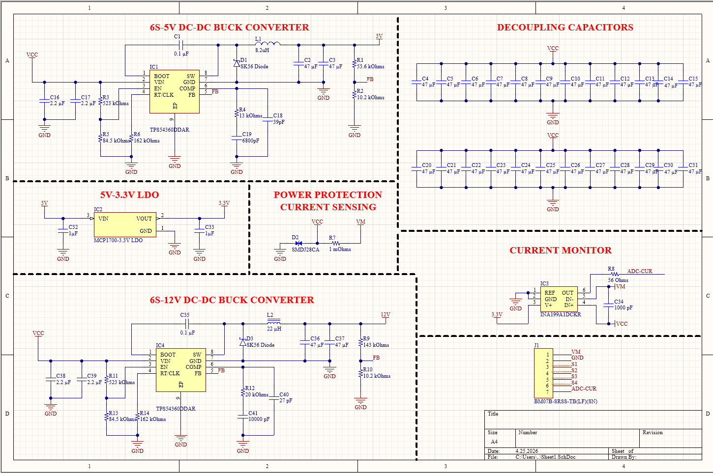
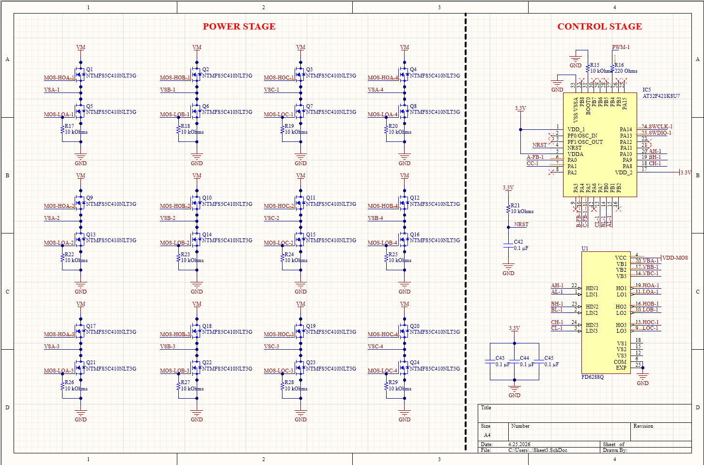

# ⚡ 4-in-1 ESC Kartı — TÜBİTAK 2209-A

*İHA sistemleri için entegre güç yönetimi ve akım ölçümü özellikli 4-in-1 Elektronik Hız Kontrolcü Kartı*

---

## 📌 Proje Hakkında

Bu proje, İnsansız Hava Araçları için geleneksel ESC'lerin ötesine geçen, yüksek entegrasyonlu bir 4-in-1 Elektronik Hız Kontrol kartı geliştirmeyi hedeflemektedir. Motor kontrol işlevine ek olarak dahili **5V ve 12V regülatör devreleri** ve **şönt direnç tabanlı akım ölçüm devresi** doğrudan kart üzerinde entegre edilmiştir. Bu sayede harici güç modüllerine olan ihtiyaç ortadan kalkmakta; daha az kablo, daha düşük ağırlık ve daha yüksek güvenilirlik elde edilmektedir.

> 🏆 **TÜBİTAK 2209-A Üniversite Öğrencileri Araştırma Projeleri Destekleme Programı**
> Danışman: Prof. Dr. Bahattin TÜRETKEN — Kocaeli Üniversitesi

---

## ⚙️ Donanım

| Bileşen | Model | Görev |
|--------|-------|-------|
| MCU | AT32F421K8U7 | Ana mikrodenetleyici |
| Gate Driver | FD6288Q | MOSFET sürücü |
| Power Stage | NTMFS5C410NLT3G | MOSFET (motor sürme) |
| DC-DC Buck | TPS54360DDAR | 6S → 5V / 12V dönüştürücü |
| LDO Regülatör | MCP1700-3.3V | 5V → 3.3V |
| Akım Sensörü | INA199A1DCKR | Şönt direnç akım monitörü |
| Shunt Direnç | CS25FTER100 | Akım ölçüm direnci |
| TVS Diyot | SMDJ28CA | Güç koruması |

---

## ✨ Özellikler

- ✈️ 4 adet BLDC motoru bağımsız ve eş zamanlı kontrol
- 🔋 6S Li-Po (22.2V) pil desteği
- ⚡ Dahili 5V ve 12V DC-DC regülatör çıkışları (harici BEC gerektirmez)
- 📊 Şönt direnç ile ±%5 hassasiyetinde toplam akım ölçümü
- 📡 ADC üzerinden uçuş kontrolcüsüne akım verisi iletimi
- 🔌 3 fazlı MOSFET köprü devresi ile yüksek verimli motor sürme

---

---

## 🎯 Proje Hedefleri

- 5V ve 12V DC-DC dönüştürücü devrelerini ESC kartına entegre etmek
- Güç hattına şönt direnç yerleştirerek **±%5 hata payı** ile toplam akım ölçümü gerçekleştirmek
- Ölçülen akım verisini MCU ADC üzerinden uçuş kontrolcüsüne iletmek
- 6S (22.2V) Li-Po uyumlu, 4 motoru eş zamanlı kontrol eden kompakt kart üretmek
- Saha testleriyle gerilim regülasyonu ve akım ölçüm hassasiyetini doğrulamak

---

## 🖼️ Görseller

### 📐 Şematik — Güç Regülasyonu ve Akım Ölçümü

---

### 📐 Şematik — Güç ve Kontrol Bölümleri

---

### 💻 PCB Tasarımı

<table>
  <tr>
    <td align="center"><b>2D Görünüm</b></td>
    <td align="center"><b>3D Görünüm</b></td>
  </tr>
  <tr>
    <td></td>
    <td></td>
  </tr>
</table>

---

### 🏭 Üretim

<table>
  <tr>
    <td align="center"><b>Kart - Ön</b></td>
    <td align="center"><b>Kart - Arka</b></td>
  </tr>
  <tr>
    <td></td>
    <td></td>
  </tr>
</table>

---

**Mert Uzun** • Kocaeli Üniversitesi • Elektronik ve Haberleşme Mühendisliği

