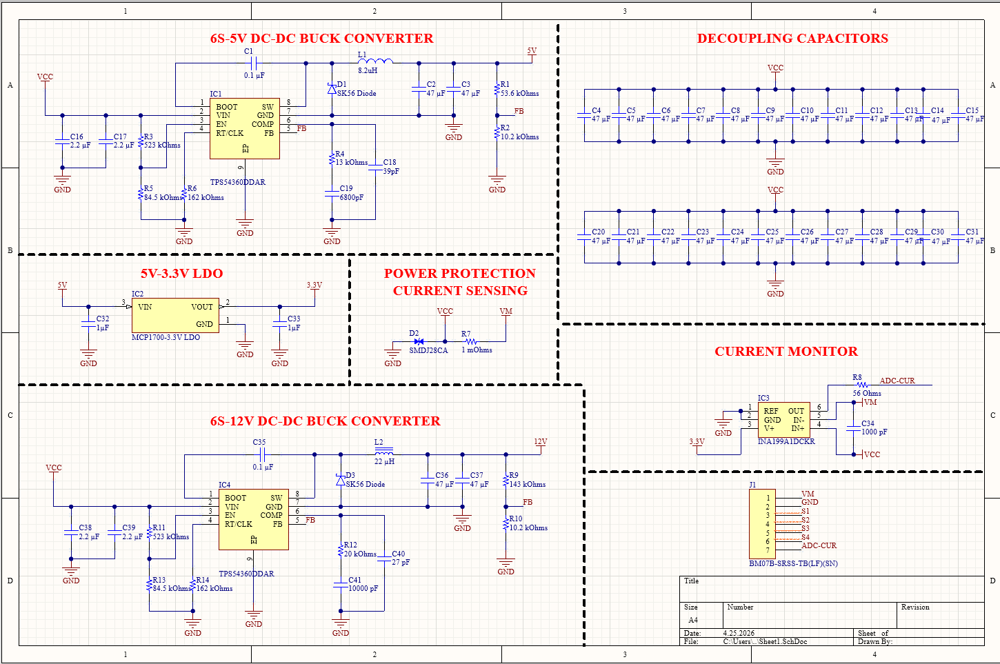
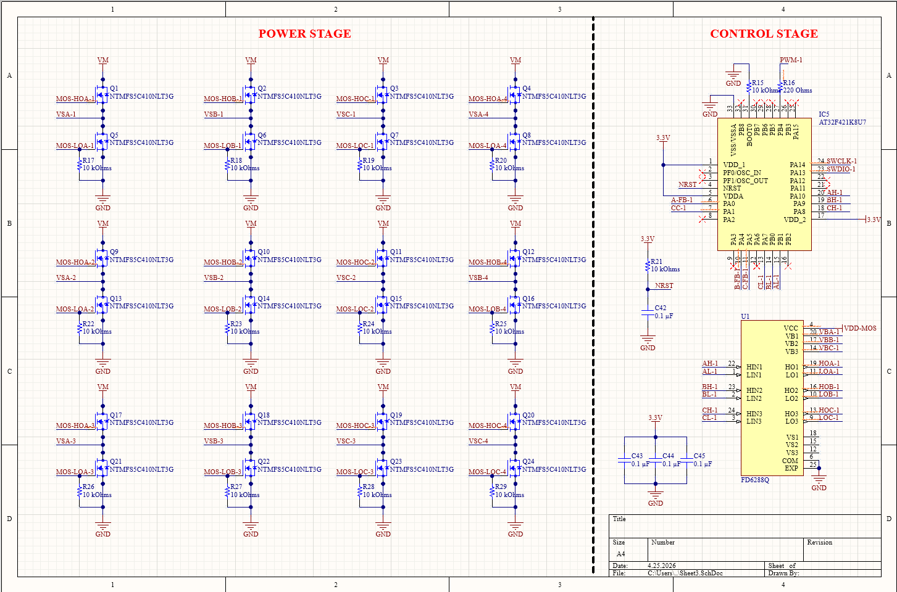

# Entegre Güç Dağıtımı ve Akım Ölçümü Özellikli 4-in-1 ESC Kartı

Bu proje, insansız hava araçlarında kullanılmak üzere dört BLDC motoru kontrol edebilen; güç dağıtımı, gerilim regülasyonu ve akım ölçümü işlevlerini tek bir kart üzerinde birleştiren 4-in-1 Elektronik Hız Kontrol (ESC) kartının geliştirilmesini kapsamaktadır.

Proje, TÜBİTAK 2209-A Üniversite Öğrencileri Araştırma Projeleri Destekleme Programı kapsamında desteklenmektedir.

## Proje Raporu

TÜBİTAK 2209-A kapsamında hazırlanan ayrıntılı proje raporuna aşağıdaki bağlantılardan ulaşılabilir.

[PDF raporunu görüntüle](mert_uzun_insansiz_hava_araclarinda_entegre_guc_dagitimi_ve_akim_olcumu_ozellikli_4in1_elektronik_hiz_kontrolcu_karti.pdf)  
[PDF raporunu indir](mert_uzun_insansiz_hava_araclarinda_entegre_guc_dagitimi_ve_akim_olcumu_ozellikli_4in1_elektronik_hiz_kontrolcu_karti.pdf?raw=1)

## Proje Bilgileri

| Bilgi | Açıklama |
|---|---|
| Proje yürütücüsü | Mert Uzun |
| Akademik danışman | Prof. Dr. Bahattin Türetken |
| Üniversite | Kocaeli Üniversitesi |
| Bölüm | Elektronik ve Haberleşme Mühendisliği |
| Destek programı | TÜBİTAK 2209-A |
| Proje durumu | Tasarım ve geliştirme aşamasında |

## Projenin Amacı

Geleneksel İHA güç sistemlerinde motor kontrolü, gerilim regülasyonu, güç dağıtımı ve akım ölçümü için birden fazla bağımsız elektronik modül kullanılmaktadır. Bu yapı; kablo sayısının artmasına, sistemin ağırlaşmasına ve bağlantı kaynaklı arıza risklerinin yükselmesine neden olabilmektedir.

Bu projede söz konusu işlevlerin tek bir PCB üzerinde birleştirilmesi amaçlanmaktadır. Geliştirilen kartın aşağıdaki işlevleri sağlaması hedeflenmektedir:

- Dört BLDC motorun bağımsız ve eş zamanlı olarak kontrol edilmesi
- 6S Li-Po batarya geriliminin motor sürücü katlarına dağıtılması
- Sistem bileşenleri için 5 V ve 12 V regüle çıkışların oluşturulması
- Güç hattından çekilen toplam akımın şönt direnç üzerinden ölçülmesi
- Akım bilgisinin analog çıkış aracılığıyla uçuş kontrolcüsüne iletilmesi
- Harici güç modüllerine ve ek kablolamaya duyulan ihtiyacın azaltılması

## Sistem Yapısı

Kartın temel yapısı dört ana bölümden oluşmaktadır:

1. **Motor sürücü katları:** Dört BLDC motor için bağımsız üç fazlı MOSFET köprüleri
2. **Kontrol birimi:** Motor sürme sinyallerini yöneten mikrodenetleyici ve gate driver devreleri
3. **Güç regülasyonu:** 5 V, 12 V ve 3.3 V gerilim seviyelerini oluşturan regülatör devreleri
4. **Akım ölçümü:** Şönt direnç ve akım algılama yükselteci kullanılarak gerçekleştirilen toplam akım ölçümü

## Teknik Özellikler

| Özellik | Hedef değer veya açıklama |
|---|---|
| Motor sayısı | 4 adet BLDC motor |
| Batarya | 6S Li-Po |
| Nominal batarya gerilimi | 22.2 V |
| Motor sürücü yapısı | Üç fazlı MOSFET köprüsü |
| Regüle çıkışlar | 5 V ve 12 V |
| Kontrol gerilimi | 3.3 V |
| Akım ölçüm yöntemi | Şönt direnç tabanlı ölçüm |
| Akım ölçüm hedefi | En fazla ±%5 hata payı |
| Uçuş kontrolcüsü arayüzü | Analog akım ölçüm çıkışı |
| Koruma | Güç hattı geçici gerilim koruması |

## Temel Bileşenler

| Bileşen | Parça numarası | Görevi |
|---|---|---|
| Mikrodenetleyici | AT32F421K8U7 | Motor kontrolü ve sistem yönetimi |
| Gate driver | FD6288Q | MOSFET anahtarlama sinyallerinin sürülmesi |
| Güç MOSFET'i | NTMFS5C410NLT3G | BLDC motor fazlarının anahtarlanması |
| DC-DC dönüştürücü | TPS54360DDAR | Regüle besleme gerilimlerinin oluşturulması |
| LDO regülatör | MCP1700-3.3V | 3.3 V kontrol geriliminin oluşturulması |
| Akım algılama yükselteci | INA199A1DCKR | Şönt geriliminin yükseltilmesi |
| Şönt direnç | CS25FTER100 | Toplam sistem akımının algılanması |
| TVS diyot | SMDJ28CA | Geçici gerilim darbelerine karşı koruma |

## Tasarım Hedefleri

- Güç dağıtımı, motor kontrolü ve akım ölçümü işlevlerini tek kartta birleştirmek
- Dört BLDC motoru eş zamanlı olarak kontrol edebilen kompakt bir donanım geliştirmek
- 6S Li-Po batarya sistemleriyle uyumlu bir güç mimarisi oluşturmak
- 5 V ve 12 V regülatör devrelerini ESC kartına entegre etmek
- Toplam sistem akımını ±%5 hata payı hedefiyle ölçmek
- Ölçülen akım bilgisini uçuş kontrolcüsüne iletmek
- Kablolama, bağlantı sayısı ve toplam sistem ağırlığını azaltmak
- Tasarım performansını laboratuvar ve saha testleriyle doğrulamak

## Şematik Tasarım

### Güç Regülasyonu ve Akım Ölçümü

Aşağıdaki şematik; batarya girişini, gerilim regülasyonu katlarını, şönt direnç tabanlı akım ölçüm devresini ve koruma bileşenlerini göstermektedir.

### Motor Kontrol ve Güç Katları

Aşağıdaki şematik; mikrodenetleyici, gate driver devreleri ve üç fazlı MOSFET motor sürücü katlarını göstermektedir.

## Proje Raporu

TÜBİTAK 2209-A kapsamında hazırlanan ayrıntılı proje raporuna aşağıdaki bağlantıdan ulaşılabilir:

[Proje raporunu görüntüle veya indir](mert_uzun_insansiz_hava_araclarinda_entegre_guc_dagitimi_ve_akim_olcumu_ozellikli_4in1_elektronik_hiz_kontrolcu_karti.pdf)

## Proje Durumu

- [x] Sistem gereksinimlerinin belirlenmesi
- [x] Devre mimarisinin oluşturulması
- [x] Temel bileşenlerin seçilmesi
- [x] Güç regülasyon devrelerinin tasarlanması
- [x] Akım ölçüm devresinin tasarlanması
- [x] Motor sürücü devrelerinin hazırlanması
- [ ] PCB tasarımının tamamlanması
- [ ] Kart üretimi ve dizgisi
- [ ] Güç katı testleri
- [ ] Motor sürme testleri
- [ ] Akım ölçüm kalibrasyonu
- [ ] Saha testleri

## Planlanan Testler

Tasarımın doğrulanması amacıyla aşağıdaki testlerin gerçekleştirilmesi planlanmaktadır:

- 5 V ve 12 V çıkış gerilimlerinin yük altında ölçülmesi
- Regülatör çıkışlarındaki gerilim dalgalanmasının incelenmesi
- Akım ölçüm devresinin referans ölçüm cihazıyla karşılaştırılması
- Dört motorun eş zamanlı çalışma testlerinin gerçekleştirilmesi
- MOSFET ve regülatör sıcaklıklarının farklı yük koşullarında izlenmesi
- Güç hattı koruma bileşenlerinin davranışının incelenmesi
- Uçuş kontrolcüsüne iletilen akım bilgisinin doğrulanması

## İletişim

**Mert Uzun**  
Kocaeli Üniversitesi  
Elektronik ve Haberleşme Mühendisliği  

[LinkedIn profili](https://www.linkedin.com/in/mert-uzun-b74459308)
